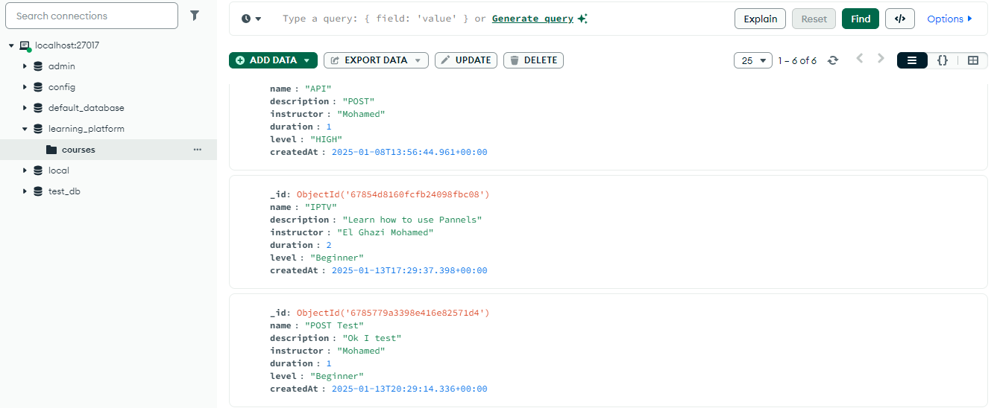

# Learning Platform NoSQL

## Table des Matières
- [Introduction](#introduction)
- [Comment Installer et Lancer le Projet](#comment-installer-et-lancer-le-projet)
- [Structure du Projet](#structure-du-projet)
- [Choix Techniques](#choix-techniques)
- [Tests et Validation](#tests-et-validation)
- [Réponses aux Questions](#réponses-aux-questions)
- [Conclusion](#conclusion)
- [Auteur](#auteur)

---

## Introduction
Ce projet est une API backend pour une plateforme d'apprentissage en ligne, élaborée dans le cadre du module NoSQL. L'objectif est de mettre en pratique les bonnes pratiques de développement d'API, tout en utilisant une base de données NoSQL pour gérer les données.

## Comment Installer et Lancer le Projet

### Prérequis
- [Node.js](https://nodejs.org/) (version 14+ recommandée)
- [MongoDB](https://www.mongodb.com/) installé localement ou accessible via un service cloud (par ex., MongoDB Atlas)
- [Redis](https://redis.io/) installé pour la gestion de la mise en cache
- Un terminal ou un environnement de développement comme VS Code

### Étapes d'installation
1. Clonez ce dépôt dans votre environnement local :
   ```bash
   git clone https://github.com/elghazi1/learning-platform-nosql
   ```

2. Accédez au dossier du projet :
   ```bash
   cd learning-platform-nosql
   ```

3. Installez les dépendances :
   ```bash
   npm install
   ```

4. Configurez les variables d'environnement dans un fichier `.env` à la racine du projet. Exemple :
   ```env
   PORT=3000
   DB_URI=mongodb://localhost:27017/learning-platform
   REDIS_HOST=127.0.0.1
   REDIS_PORT=6379
   JWT_SECRET=your_jwt_secret
   ```

### Lancer le Projet
Pour démarrer le serveur en mode développement :
```bash
npm run dev
```

Pour démarrer le serveur en mode production :
```bash
npm start
```

Le projet sera disponible à l'adresse suivante : [http://localhost:3000](http://localhost:3000).


## Structure du Projet
Voici une description de l'organisation du code :

```plaintext
src/
|-- config/
|   |-- db.js            # Configuration de la connexion à la base de données
|   |-- env.js           # Gestion des variables d'environnement
|-- controllers/
|   |-- courseController.js  # Logique métier liée aux cours
|-- routes/
|   |-- courseRoutes.js      # Définition des routes pour les cours
|-- services/
|   |-- mongoService.js      # Services pour MongoDB
|   |-- redisService.js      # Services pour Redis
|-- app.js                # Point d'entrée principal de l'application
```



## Choix Techniques

### Base de données
- **MongoDB** a été choisi pour sa flexibilité dans la gestion de données non structurées et son intégration facile avec Node.js.

### Mise en cache
- **Redis** est utilisé pour la gestion de la mise en cache des données fréquemment demandées, réduisant ainsi les appels à MongoDB.

### Framework
- **Express.js** a été utilisé pour sa simplicité et sa robustesse dans la création d'API RESTful.

### Variables d'environnement
- Les paramètres sensibles comme l'URI de la base de données et les clés secrètes sont gérés via un fichier `.env` pour sécuriser les configurations.

### Gestion des erreurs
- Une gestion centralisée des erreurs permet de renvoyer des réponses cohérentes à l'utilisateur.

### Modélisation des données
- Les schémas MongoDB sont définis dans `services/mongoService.js` pour assurer la cohérence des données.

## Tests et Validation

### Outils Utilisés
- **Postman** : pour tester les routes de l'API.
- **MongoDB Compass** : pour vérifier les données insérées dans la base de données.
- **Redis Insights** : pour monitorer la gestion du cache.

### Tests Effectués

1. **Création d'un cours**
   - **URL** : POST `http://localhost:3000/courses`
   - **Payload** :
     ```json
     {
       "name": "API Basics",
       "description": "Introduction to APIs"
     }
     ```
   - **Résultat attendu** : Code 201 avec un message de succès et l'ID du cours créé.
   - **Capture d'écran** :
     

2. **Récupération d'un cours valide**
   - **URL** : GET `http://localhost:3000/courses/{id}`
   - **Résultat attendu** : Code 200 avec les détails du cours.
   - **Capture d'écran** :
     

3. **Statistiques des cours**
   - **URL** : GET `http://localhost:3000/courses/stats`
   - **Résultat attendu** : Code 200 avec le total des cours.
   - **Capture d'écran** :
     

4. **Gestion du cache Redis**
   - **Avant ajout** : Redis était vide.
     
   - **Après ajout** : Les données des cours sont mises en cache avec une durée de vie de 20 minutes.
     

### Logs des Tests
1. **Cache miss et données mises en cache**
   - 
2. **Cache hit et récupération des données de Redis**
   - 
3. **Erreur Redis indisponible**
   - 
4. **Retour des données via MongoDB après panne Redis**
   - 
5. **Requête invalide : 404 non trouvé**
   - 

## Réponses aux Questions
Voici les réponses aux questions posées dans les commentaires du code :

1. **Comment organiser le point d'entrée de l'application ?**
   - Le point d'entrée (ex. : app.js) doit être minimal et se limiter à :
     1. Charger les dépendances principales (ex. : express, middlewares, etc.).
     2. Configurer les middlewares globaux.
     3. Charger les routes en provenance de fichiers séparés.
     4. Initialiser les connexions aux bases de données et autres services (ex. Redis).
     5. Lancer le serveur en écoutant sur un port défini.
   - Cela garantit une organisation claire et une meilleure testabilité.

2. **Quelle est la meilleure façon de gérer le démarrage de l'application ?**
   - Utiliser une fonction asynchrone dédiée, par exemple :
     ```javascript
     async function startServer() {
       try {
         await connectToDatabase(); // Initialisation MongoDB
         await connectToRedis(); // Initialisation Redis
         app.listen(process.env.PORT, () => {
           console.log(`Server running on port ${process.env.PORT}`);
         });
       } catch (error) {
         console.error("Failed to start the server:", error);
         process.exit(1); // Arrêt si une erreur critique survient
       }
     }
     startServer();
     ```

   - Cela permet de capturer les erreurs et de gérer les dépendances avant le démarrage.

3. **Comment gérer efficacement le cache avec Redis ?**
   - Utiliser des conventions claires pour nommer les clés dans Redis (ex. : namespace:key, comme courses:123).
   - Mettre en place une politique de durée de vie (TTL) pour éviter l'accumulation de données obsolètes.
   - Mettre à jour ou invalider le cache lorsque les données dans MongoDB changent.

4. **Quelles sont les bonnes pratiques pour les clés Redis ?**
   - Utiliser des noms de clés descriptifs et hiérarchiques (ex. : user:profile:123).
   - Limiter la durée de vie (TTL) des données temporaires.
   - Documenter les conventions utilisées dans le projet.
   - Ajouter des préfixes spécifiques au projet pour éviter les conflits (appname:feature:key).

5. **Pourquoi créer des services séparés ?**
   - Cela permet de :
     1. Réutiliser facilement la logique métier dans différents contrôleurs.
     2. Réduire la complexité des contrôleurs et routes.
     3. Faciliter les tests unitaires en isolant les services.

6. **Pourquoi séparer les routes dans différents fichiers ?**
   - Pour :
     1. Organiser le code de manière modulaire et lisible.
     2. Faciliter la maintenance et l'ajout de nouvelles fonctionnalités.
     3. Permettre le chargement dynamique des routes si nécessaire.

7. **Comment organiser les routes de manière cohérente ?**
   - Grouper les routes par fonctionnalité dans des fichiers séparés (ex. : courseRoutes.js, userRoutes.js).
   - Utiliser un fichier central (ex. : index.js dans routes/) pour importer et enregistrer toutes les routes.
   - Respecter les conventions RESTful (ex. : GET /courses, POST /courses).

8. **Quelle est la différence entre un contrôleur et une route ?**
   - **Route** : Définie l'URL et le type de requête HTTP (GET, POST, etc.). Elle agit comme une passerelle.
   - **Contrôleur** : Contient la logique métier associée à une route (traitement des données, validation, appels aux services).

9. **Pourquoi séparer la logique métier des routes ?**
   - Cela permet de rendre les routes plus lisibles et centrées sur la définition des points d'accès.
   - Facilite la réutilisation de la logique métier dans d'autres contextes.
   - Permet de tester la logique métier indépendamment.

10. **Pourquoi est-il important de valider les variables d'environnement au démarrage ?**
    - Pour s'assurer que toutes les informations critiques (ex. : URI MongoDB, clé Redis, port) sont définies avant de démarrer l'application. Cela évite des erreurs inattendues plus tard.

11. **Que se passe-t-il si une variable requise est manquante ?**
    - L'application doit arrêter son exécution et afficher un message d'erreur clair. Cela peut être fait en vérifiant les variables comme suit :
      ```javascript
      if (!process.env.DB_URI || !process.env.REDIS_HOST) {
        console.error("Environment variables are missing!");
        process.exit(1);
      }
      ```

12. **Pourquoi créer un module séparé pour les connexions aux bases de données ?**
    - Centraliser la logique de connexion pour éviter la duplication.
    - Gérer facilement les erreurs et les reconnections.
    - Permettre une meilleure isolation pour les tests.

13. **Comment gérer proprement la fermeture des connexions ?**
    - Capturer les signaux système comme SIGINT ou SIGTERM pour fermer les connexions proprement :
      ```javascript
      process.on('SIGINT', async () => {
        await closeDatabaseConnection();
        await closeRedisConnection();
        console.log("Connections closed. Exiting...");
        process.exit(0);
      });
      ```

14. **Quelles sont les informations sensibles à ne jamais commiter ?**
    - Clés API.
    - URL ou URI des bases de données.
    - Secrets de chiffrement (ex. : JWT_SECRET).
    - Identifiants d'accès à des services externes (ex. : clés cloud).
    - **Ces informations doivent être dans le fichier .env.**

15. **Pourquoi utiliser des variables d'environnement ?**
    - Séparer les configurations sensibles du code.
    - Simplifier les déploiements en utilisant des configurations spécifiques à l'environnement (développement, production, etc.).
    - Augmenter la sécurité en évitant le stockage des informations sensibles directement dans le code.

## Conclusion
Ce projet illustre les bonnes pratiques de développement pour une API backend en utilisant une base de données NoSQL et des outils modernes comme Redis pour optimiser les performances. Chaque fonctionnalité a été testée et documentée avec des captures d'écran.

## Auteur
- **Nom** : Mohamed EL GHAZI
- **Email** : mohamed.elghazi6-etu@etu.univh2c.ma
- **GitHub** : [https://github.com/ElGhazi1](https://github.com/ElGhazi1)

